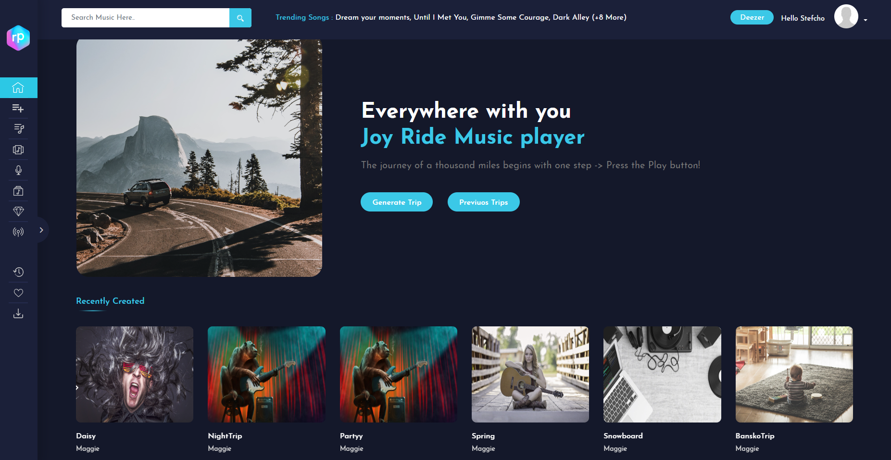
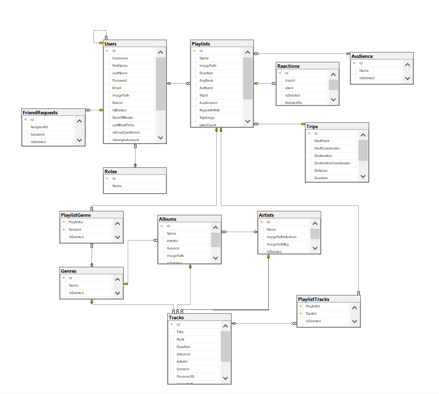

# RidePal

Playlist generator for your travel.

# Project Description

RidePal enables your users to
generate playlists for specific travel duration periods based on their preferred genres. Uppon login users can browse other public playlist, songs, artists, albums and connect with friends in Ridepal system.

# 🖥️ Website



# 🔗 Links

* [Site](https://ridepalweb.azurewebsites.net/)


# 🚪 How to install 
```diff
 To use this application you will need the following tools:
    - Visual Studio 2019 or newer
    - Microsoft SQL Server
    
+ 1. Download the project
  2. Open the .sln file
  3. Setup database migration
  4. Open package manager and run Update-Database command
  5. Start the project 
```

# Functional Requirments 
Generate playlists for specific travel duration periods based on their preferred genres.

A playlist consists of a list of individual tracks (songs). Each track has an artist, title,
album, duration (playtime length) and rank (a numeric value). Tracks may or may not
have a preview URL to an audio stream (e.g. the users can click and play the preview

## Entities 

``` 
☑️ Each track has an artist, title,
album, duration (playtime length) and rank (a numeric value).

☑️ A playlist consists of a list of individual tracks (songs).

☑️ Album consists of artist(author) and track list

☑️ Artist consists of artist name, collections of albums and tracks

☑️ Each playlist has a user given title, a list of tracks with the associated track details, total playtime (the sum of the playtimes of all tracks in that playlist) and likes count.

☑️ User password must be atlest 8 symbols. 

☑️ Username must be atlest 4 symbols.

☑️ Username and email must be unique in the system.

☑️ Each travel must have a starting and ending points via Bing Map API
 ```

## 📢 Public Part 
```diff
☑️  The public part of your project must be visible without authentication. This includes the application start page, the user login and user registration forms, about page, as well as the list of all user generated playlists.

☑️ Anonymous users must be able to see application start page, about page, as well as the list of all user generated playlists. 

☑️ Anonymous users must be able to register and login. Registration of a new user should use email verification flow.

☑️ Anonymous users can not see detailed information about RidePal neither they can interact with the website.
```

## 🔒 Private part
```
☑️ Accessible only if the user is authenticated.

☑️ Users must be able to login/logout, update their profile, set a profile photo/avatar.

☑️ Each user must be able to create a trip with desired genres, options(unique artists, top ranks).

☑️ Each user must be able to edit and delete a his own playlists.

☑️ On create of trip, the system will return a generated playlist taking into account personal requirments.

☑️ Each user must be able to browse the available playlist(only those marked as public) created by other users with an option to sort and filter them. List with playlist should support pagination.

☑️ Each user must be able to search other users, playlists, albums, artists, tracks.

☑️ Each user must be able to send friend request and connect with other users.
```
# 👨‍💻 Administrative part
```
☑️ Accessible to users with administrative privileges.

☑️ Admin users must be able to see list of all users and search them by phone number, username or email and block or unblock them. A blocked user must not be able to create travels and apply for travels. List with users should support pagination.

☑️  Administrators must be able to manually trigger Deezer synchronization

☑️  Administrators must be able to edit/delete over the playlists
```

#### REST API

To provide other developers with your service, you need to develop a REST API. It should leverage HTTP as a transport protocol and clear text JSON for the request and response payloads.

A great API is nothing without a great documentation. The documentation holds the information that is required to successfully consume and integrate with an API. You must use Swagger to document yours.

The REST API provides the following capabilities:

1. Users

* CRUD operations (must)

* Block/unblock user (must)

* Search by username, email, or id (must)

* Send friend requests (must)

* Browse user's playlists (must)

2. Tracks

* Get tracks by id, genre, top rank(must)

* Generate tracklist with/without dustinct artists by given duration for the playlist. (must)

3. Albums

* Get albums by genres, id(must)

4. Artist

* Get artist by name, id(must)

* Get artist's albums or tracks by id(must)

5. Playlist

* CRUD operations (must)

* Get playlist by id(must)

6. Trip

* CRUD operations (must)

#### Database

The data of the application must be stored in a relational database. You need to
identify the core domain objects and model their relationships accordingly.

Database structure should avoid data duplication and empty data (normalize your
database).

Your repository must include two scripts – one to create the database and one to fill
it with data.

# 📈 Database Diagram



# External Services

RidePal application must consume atleast two public RESET services to achieve main functionalities, we chose to depend on 4 external services

##### Microsoft Bing Maps

Help us to calculating the path from A to B and graphically show the shortest path between the two cities.

##### Deezer

Help us to pre-fetch and store in our Database all the tracks, artists, albums needed. Deezer JavaScript SDK allowed us to integrate a fully functional player with all the needed options.  

##### AWS Cloud services

In AWS Cloud we store all images needed for users profile pictures and playlist's ones.

##### Pixabay

On playlist creating random cover photo from pixabay is applied dynamicly and stored in AWS Cloud.

## Git

Commits in the GitLab repository should give a good overview of how the project was developed, which features were created first and the people who contributed. Contributions from all team members must be evident through the git commit history! The repository must contain the complete application source code and any scripts (database scripts, for example).

## 👷 Built with:
* ASP .NET Core
* MsSQL Server
* Entity Framework
* Swagger
* Azure hosting
* Mail Service
* Cookies for WEB
* Deezer API
* Google OAuth 2.0
* Bing API
* Pixabay API
* AWS API
* Unit Testing
* HTML5/CSS/Bootstrap

## 🤝 Authors

* Radoslav Berov [GitLab](https://gitlab.com/rado.berov.561) | [LinkedIn](https://www.linkedin.com/in/radoslav-berov-58057a19b/)


* Margarita Balimezova [GitHub](https://github.com/MargaritaBalimezova) | [LinkedIn](https://www.linkedin.com/in/margarita-b-650ba7a8/)


* Angel Marinski [GitHub](https://github.com/AngelMarinski) | [LinkedIn](https://www.linkedin.com/in/angel-marinski-957b74259/)
